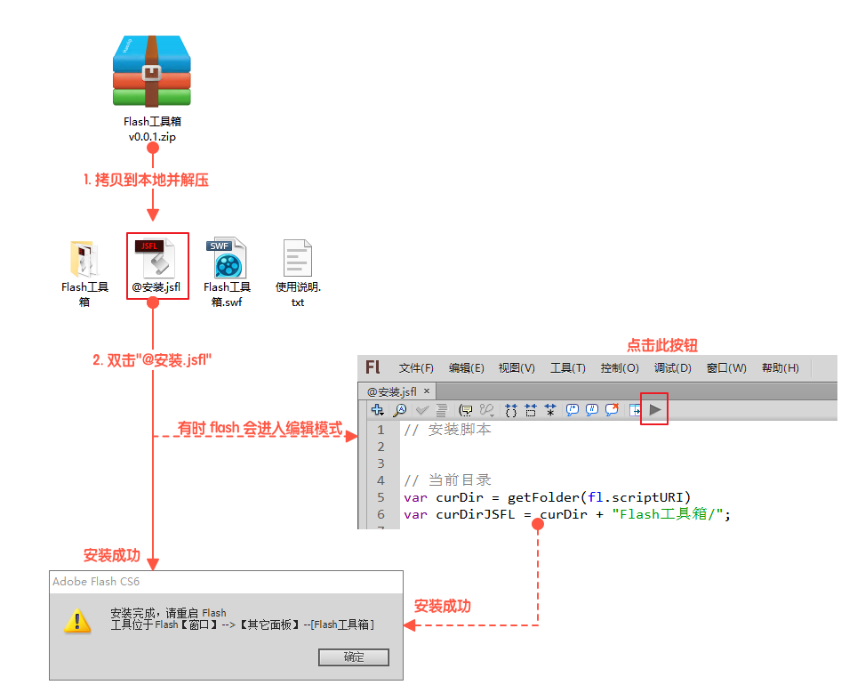
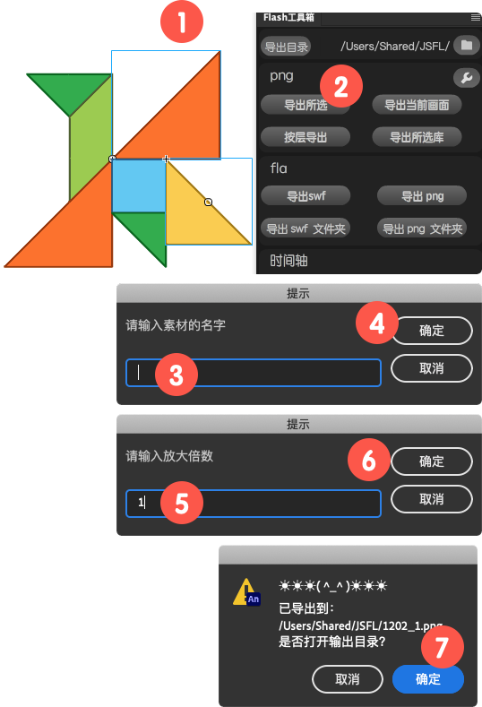

# Flash工具箱
一个小插件，可以快速将flash对象**导出成png**。插件支持 **Flash CS5.5** 以及之后的版本。

**主界面**

 

## 安装

解压zip包，点击 “**@安装.jsfl**” 进行安装，安装完成后，重启Flash，在菜单栏“**窗口**”-->**其它面板**--**Flash工具箱**启动插件，(安装完成后，zip压缩包和解压后的文件都可以删除)。

 

**使用**

 

# 导出所选

**“导出所选”**，可以将选中的显示元素合并导出成一张png，相当于将选中的部分，单独拷贝到一个新的文档中，新文档的舞台大小跟选中元素大小一致，然后导出成png。

**操作：**

- 在舞台上选中任意元素（支持多个），点击“**导出所选**”；

- 在提示框中输入素材的名字，点确定，进入下一步。（如果选中的是元件，会自动读取元件在**舞台上的实例名**或在**元件库里的名字**）

- 在提示框中输入缩放值，1表示不缩放，1表示放大2倍；

- 导出完成后，会提示是否打开输出目录，点击“确定”按钮后会在打开资源管理器，并选中导出的png文件。

- 点击插件界面的文件夹小图标，可以更改导出目录

  

# 导出当前画面

点击后会将当前舞台的样子，导出成一张png，按钮功能相当于在Flash中执行导出图像操作

# 按层导出

将**主舞台**上的每一层内容导出成png，导出的全部分层尺寸都是一致的，拖到PS里不用手动调整元素位置。

- 只支持导出主舞台上的图层，元件内部可以通过**拷贝图层**命令拷贝到一个新文档中，然后再操作；
- 导出的状态为时间轴当前帧状态；

- 如果导出的尺寸和舞台不一致，可以点击尺寸小图标进行恢复，在 **导出png** 面板中，选中“**完整文档大小**”，然后点击导出按钮，此时会导出一张图片，导出操作完成后，导出设置就恢复到默认状态了；

# 导出所选库

此按钮的功能相当于，在元件库里选中一个元件，然后点击鼠标右键，执行“**导出png序列**”操作。你可以选中多个库，然后点击此按钮来快速导出库成png序列。

序列帧的命名格式为“**[导出目录]/[fla文档名]/[元件名]_0001.png**”

<strong>Enjoy！👻</strong>

* * *

最后如果觉得这个插件不错，有帮到你的话，也可以请我喝杯咖啡☕️。

